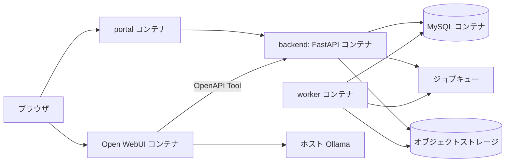

# Docker中心の開発・デバッグ環境計画

更新日: 2026-07-12  
状態: 決定

## 目的と原則

業務ポータル、業務API、ワーカー、データストアを Docker Compose で起動する。開発・テスト・トラブルシュートで動くPythonの実行環境も、原則として同じコンテナイメージに含める。DockerなしWindowsへの配布・起動は [DockerなしWindows PCへの配布・起動計画](windows_distribution_plan.md) に従う。

これにより、開発者のホストOSやローカルPythonの差ではなく、Gitで管理するDockerfile・依存関係・Compose設定を再現の基準にする。Open WebUIは公式イメージを無改造で使い、業務アプリとは別コンテナとする。

## 実行モード

| モード | 用途 | 起動対象 | Pythonの扱い |
| --- | --- | --- | --- |
| 開発 | 日常実装、画面確認、APIデバッグ | Open WebUI、portal、backend、worker、DB、必要なストレージ | `backend`/`worker` の開発用コンテナで実行。ソースをマウントし、再読み込みとテストを可能にする |
| テスト | 単体・結合・契約テスト | 対象サービスとテスト用DB | 開発用と同一のPythonイメージでテストを実行する |
| トラブルシュート | 障害再現、DB/ジョブ/Toolの調査 | 必要最小限のサービス | `docker compose exec` または `run --rm` で、同じ依存関係のシェル・pytest・診断コマンドを使う |
| ステージング | Open WebUI更新・リリース候補の回帰 | 本番相当のイメージと設定 | 開発用のソースマウント・デバッガを含めない |

ホストPythonは必須にしない。Dockerが使えないWindows端末でのOpen WebUI単体起動は [実行環境管理方針](runtime_management.md) の補助手段として維持するが、業務アプリの正規の開発・検証環境にはしない。

## 予定するCompose構成



| サービス | 役割 | 開発時の扱い |
| --- | --- | --- |
| `open-webui` | 会話、Knowledge/RAG、モデル接続 | 公式イメージを固定バージョンで使用。改造しない |
| `portal` | 案件・成果物・進捗の業務UI | ソースマウントとホットリロードを許可する |
| `backend` | FastAPI、認可、案件、CSV、監査、OpenAPI Tool | ソースマウント、API自動再読み込み、テスト・デバッガを許可する |
| `worker` | OCR、解析、集計、PDF生成などの非同期処理 | `backend` と同じアプリ依存を使い、異なる起動コマンドにする |
| `db` | 業務MySQL | 名前付きボリュームとマイグレーションで管理する。Open WebUIの内部DBとは分ける |
| `queue` / `object-storage` | ジョブ制御と成果物保存 | P1着手時に追加する。ローカルではComposeサービスとして再現する |

## ファイルと依存関係の管理

```text
infra/
├── compose.yaml             # 共通サービス定義。開発・ステージングで共用
├── compose.dev.yaml         # ソースマウント、再読み込み、デバッグポート
├── compose.test.yaml        # テストDB、テスト実行用の上書き
└── .env.example             # ポート・公開可能な開発既定値のみ
backend/
├── Dockerfile               # Python 3.11を基準にした実行イメージ
├── pyproject.toml           # アプリ・開発用依存の定義
├── lockfile                 # Dockerとローカル補助環境で共通に使う固定依存
└── tests/
portal/
├── Dockerfile
├── package.json
└── lockfile
```

- Pythonは 3.11 に固定する。Dockerfile、CI、任意のローカル仮想環境で同じメジャー/マイナー版を使う。
- `backend` と `worker` は同じPython依存を共有し、実行コマンドだけを分ける。
- 依存追加・更新ではロックファイルを必ず更新し、コンテナを再ビルドしてテストする。
- Python仮想環境、Nodeモジュール、DBデータ、成果物、ログ、`.env` はGitへ追加しない。

## デバッグとトラブルシュートの標準手順

### API / ワーカー

1. 開発プロファイルだけで `debugpy` を有効にし、ホストへは `127.0.0.1` に限定したポートを公開する。
2. IDEはコンテナ内のPythonプロセスへアタッチする。ホストの別Pythonでアプリを起動しない。
3. `docker compose exec backend` でシェル、pytest、マイグレーション、診断コマンドを実行する。
4. ワーカー障害は `job_id`、構造化ログ、再試行回数、エラー要約で追跡する。コンテナ内の一時ファイルだけを根拠にしない。

### フロントエンド

1. `portal` の開発サーバーはコンテナ内で起動し、ホストのブラウザからアクセスする。
2. API URLやOpen WebUI URLは環境変数で渡し、ソースコードやビルド成果物へ固定しない。
3. ブラウザ開発者ツールとポータルの構造化ログを使用し、Open WebUIのDOMを調査・操作対象にしない。

### Open WebUI / Ollama

1. コンテナログ、ヘルスチェック、Ollamaのモデル一覧・生成応答を順に確認する。
2. Open WebUIの設定・Tool呼出し以外の内部実装をデバッグ対象にしない。
3. Open WebUIの問題を再現する際も、業務APIとToolのHTTPリクエスト/レスポンスを記録して境界で切り分ける。

## セキュリティと運用上の制約

- デバッグポート、DB、キュー、オブジェクトストレージは開発端末のローカルインターフェースにのみ公開する。
- 例外詳細、SQL、リクエスト本文、LLM入出力をログへ出す場合は、開発用であっても秘密情報と個人情報をマスクする。
- Composeの名前付きボリューム削除はデータを消すため、`down -v` は明示的な初期化時にだけ実行する。
- テストは本番用ボリューム・本番データ・本番Ollama設定を使わない。

## 実装順序と完了条件

1. `infra/compose.dev.yaml`、`backend/Dockerfile`、`portal/Dockerfile` の雛形を追加する。
   - 完了条件: 開発者がGit clone後、Docker Composeだけで全サービスを起動できる。
2. `backend` のPython依存・テスト・Lint・デバッグプロファイルを追加する。
   - 完了条件: コンテナ内でAPIの単体テストを実行し、IDEから停止点へアタッチできる。
3. `portal` のホットリロードと、ポータル→APIの結合テストを追加する。
   - 完了条件: P0画面の変更が再ビルドなしで確認でき、API契約違反をテストで検出できる。
4. DBマイグレーション、ワーカー、テスト用データをComposeへ追加する。
   - 完了条件: 空のDocker環境から案件・権限・ジョブのP0シナリオを再現できる。
5. Open WebUI更新のステージングComposeと回帰チェックを追加する。
   - 完了条件: 業務アプリを改変せず、Open WebUI候補版の採否を判断できる。
