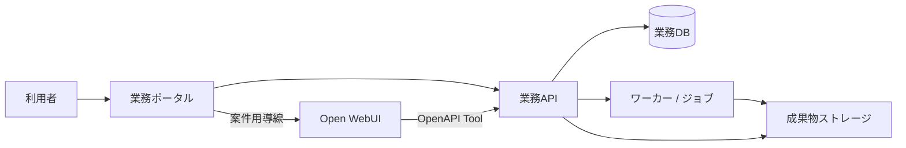

# 業務ポータル開発計画

更新日: 2026-07-12  
状態: 初期計画

## 方針

このプロジェクトでは Open WebUI を改造しない。Open WebUI は、会話、モデル接続、標準ファイル管理、Knowledge/RAG、標準のユーザー・グループ管理を担う既製サービスとして利用する。

独自に開発するフロントエンド（以降「業務ポータル」）は、案件を起点に業務データと成果物を扱う画面とする。Open WebUI のチャットUIを再実装・埋込・DOM操作せず、案件選択済みの利用者を適切な Open WebUI の会話・Knowledge へ案内する。業務機能は業務APIを介して提供する。

この方針により、Open WebUI の更新を業務ポータルのリリースと切り離す。連携契約は公開された設定、OpenAPI Tool、通常のHTTP APIに限定し、Open WebUIの内部DB、非公開API、DOM/CSSセレクタには依存しない。

## 根拠となる既存資料

| 事項 | 参照資料 | 計画への反映 |
| --- | --- | --- |
| Open WebUIと独自サービスの責務分離 | `open_webui_migration_00_readme.md`、`open_webui_migration_04_target_architecture.md` | チャットを複製せず、案件・権限・CSV・帳票・監査を業務ポータル/APIに置く |
| 画面と利用者フロー | `open_webui_migration_02_user_flows.md` | 「案件選択 → チャット/業務処理 → 成果物確認」をポータルの主導線にする |
| 業務機能と優先度 | `open_webui_migration_01_current_inventory.md` | P0を案件・権限・資料・監査、P1をCSV・資料メモ・帳票とする |
| API・データ・ジョブ境界 | `open_webui_migration_03_backend_data.md` | 重い処理はジョブ化し、ポータルで進捗・失敗理由を表示する |

## システム境界

| コンポーネント | 責務 | 更新影響を抑える境界 |
| --- | --- | --- |
| Open WebUI | 会話、Knowledge/RAG、モデル利用、標準添付 | 設定とOpenAPI Toolのみ。fork、内部API、画面改造をしない |
| 業務ポータル | 案件、メンバー、資料/CSV/成果物一覧、進捗、承認 | 業務APIのバージョン付きHTTP契約のみを利用する |
| 業務API | 認可、案件コンテキスト、データ操作、監査、Tool契約 | Open WebUIからも同じOpenAPI契約で利用する |
| ワーカー | OCR、抽出、集計、帳票生成、再試行・取消 | `job_id` と状態遷移を業務APIへ返す |

## 利用者導線と画面範囲

### P0: 日常利用の基盤

| 画面/機能 | 利用者が行うこと | 業務APIの責務 | 完了条件 |
| --- | --- | --- | --- |
| 案件一覧 | 権限のある案件を検索・選択する | 一覧を利用者権限で絞る | 権限外案件を表示・推測できない |
| 案件概要 | 状態、所在地、期間、メンバー、関連成果物を確認する | 案件とロールを返す | manager/member/viewer の表示・操作差が確認できる |
| メンバー管理 | 権限に応じて参加者を管理する | ロール変更を認可・監査する | 権限のない変更を拒否し、監査イベントを残す |
| 資料一覧 | 資料を登録し、状態・公開範囲を確認する | メタデータ、保存、処理状態を管理する | 登録状況と失敗理由をポータルで確認できる |
| チャットへの導線 | 案件を確認してから Open WebUI を開く | 案件コンテキストを検証し、必要な導線情報を返す | 案件未選択の業務Tool実行を防ぐ |
| 監査/ジョブ一覧 | 操作履歴・処理状態を確認する | 監査イベント、`job_id`、状態、エラー要約を返す | チャット外でも進捗と失敗理由を確認できる |

### P1: 差別化する業務機能

| 画面/機能 | 利用者が行うこと | 実装上の要点 |
| --- | --- | --- |
| CSVカタログと取込 | CSV/TSVの登録、プレビュー、品質確認を行う | 大量行をJSONテーブルに固定せず、分析用ストアへ正規化する |
| 安全な集計 | 対象データと集計結果・根拠を確認する | 集計は決定論的Toolで実行し、SQLは読み取り専用・allowlist・上限を適用する |
| 資料メモ | 案件資料メモの作成、版、承認を行う | 公開版のみ必要に応じてKnowledgeへ同期する |
| 成果物一覧 | CSV、PDF、資料メモを参照・取得する | 会話本文を直接PDF化せず、構造化した `ReportDraft` を承認後に出力する |
| 非同期ジョブ詳細 | OCR、解析、帳票生成を再試行・取消する | 実行中の処理をHTTPリクエストやチャット内で完走させない |

### P2以降: 利用実績で判断する機能

- FAQ化、CSV統合・AI分類、外部PostgreSQL取込、図解の高度化
- 多段推論、LLM judge、案件横断調査、watchdog

P2以降は、P0/P1の操作ログ、失敗率、利用頻度、運用コストを評価してから個別に採否を決める。

## 実施フェーズ

### 0. 契約と開発基盤を確定する

1. `portal/` と `backend/` の採用技術、ローカル起動方法、テスト方法を決定する。
2. 業務ポータルから利用する認証方式と、Open WebUIユーザーIDとの対応方式を設計する。
3. `案件一覧`、`案件詳細`、`案件権限確認` のAPI契約とエラー形式を定義する。
4. Open WebUI更新時のステージング回帰項目を定義する。

完了条件: フロントエンドと業務APIの境界、認可責務、ローカル開発・自動テストの入口が文書化されている。

### 1. P0ポータルを実装する

1. 案件一覧、案件概要、メンバー、資料一覧、成果物/ジョブ一覧の画面を実装する。
2. ロールに基づく表示・操作制御を実装する。ただし最終認可は必ず業務APIで行う。
3. Open WebUIへの案件用導線を実装し、案件未選択時の業務操作を止める。
4. 操作・認可拒否・ジョブ失敗をポータル上で説明可能にする。

完了条件: 権限のある利用者が案件を選び、資料状態・ジョブ・成果物を確認し、安全にOpen WebUIへ移動できる。

### 2. P1データ・成果物機能を実装する

1. CSV取込、品質確認、決定論的集計、結果保存を実装する。
2. 資料メモの版・承認と、成果物一覧を実装する。
3. PDF生成を非同期ジョブにし、`ReportDraft` の確認・出力・再試行を実装する。
4. OpenAPI Toolで集計、案件検索、成果物登録、ジョブ照会をOpen WebUIへ公開する。

完了条件: チャットとポータルのいずれから始めても、権限と案件範囲を保って成果物を作成・確認できる。

### 3. 更新互換性と運用を固める

1. Open WebUIを更新するステージング手順を整備する。
2. ログイン、モデル接続、Knowledge、日本語RAG、OpenAPI Tool、会話ストリームを回帰テストする。
3. ポータル/APIはOpen WebUIと別々にデプロイし、契約互換性を検査する。

完了条件: Open WebUI更新の影響範囲をテストで検知し、業務ポータルのリリースなしでもアップデート可否を判断できる。

## 非機能・安全性の完了条件

- 業務APIは、ポータルとToolの双方から受け取る利用者・案件・操作情報を再検証する。
- `project_id`、SQL、ロールなどのクライアント入力を信頼しない。
- Text-to-SQLは、読み取り専用アカウント、許可ビュー/テーブル、構文または厳格なallowlist、行数・実行時間制限を必須にする。
- 秘密情報、トークン、個人情報、DBダンプをリポジトリとログに残さない。
- ポータルはOpen WebUIのDOM、Cookie、内部DBを利用しない。SSO等のID連携を採用する場合も、公開された認証フローを使う。

## 次に確定する事項

1. 業務ポータルの技術スタックと認証方式
2. Open WebUIユーザーと業務利用者のID対応方式
3. 案件コンテキストをOpen WebUIのTool呼出しへ伝える方式
4. P0画面のワイヤーフレームとAPIスキーマ
