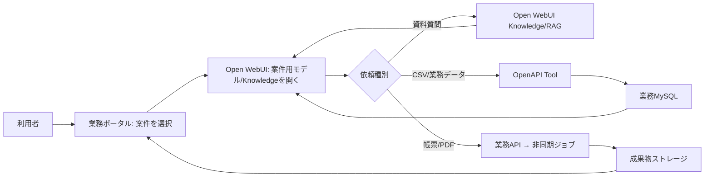

# 画面・操作・ユーザーフロー

## 現行画面の読み替え

現行 `support.php` は、案件一覧、案件中心タブ、チャットを一画面にまとめています。新構成ではこの画面を再現せず、会話は Open WebUI、案件の編集・一覧は必要最小限の独自ポータルへ分離します。

| 現行の操作 | 新構成の置き場（提案） |
| --- | --- |
| ログイン、モデル選択、会話履歴、通常チャット、ファイル添付 | Open WebUI 標準 |
| 案件作成/編集、案件切替、所在地/期間/状態 | 独自フロントエンド（業務ポータル） |
| 資料・ナレッジの検索と会話への添付 | Open WebUI Knowledge / ファイル管理 |
| 案件ごとの資料メモ作成・承認・版管理 | 独自フロントエンド + 業務API。必要なら公開版のみKnowledgeへ同期 |
| CSV一覧、プレビュー、取込、集計結果の保存 | 独自フロントエンド + 業務API |
| CSV集計・外部DB検索・帳票生成 | OpenAPI Tool 経由でFastAPIを呼ぶ |
| 回答の図/帳票/CSV化 | Open WebUIのAction/Tool起点 + 業務API。成果物一覧は独自ポータル |

## 基本フロー（提案）

## 利用者フロー

1. 利用者は業務ポータルで案件を選び、案件の権限と対象Knowledgeを確定する。
2. ポータルは Open WebUI の案件用モデル/会話への導線を提示する。案件IDはURLだけで信頼せず、業務APIがトークンまたはサーバー側のコンテキストで検証する。
3. 資料の質問はKnowledge/RAGを優先し、根拠リンク・ファイル名を回答に残す。
4. 集計・検索・登録などはモデルが業務Toolを呼ぶ。Toolは案件権限、許可操作、対象範囲を検査する。
5. 長時間の解析・PDF生成はジョブを作成して即時に受付を返し、ポータルで状態・結果・失敗理由を表示する。
6. 完成した資料、CSV、PDFは業務ポータルの成果物一覧へ保存する。必要な公開版だけをKnowledgeへ同期する。

## 図モード・報告書モード

- **図モード**: 小さな時系列・分布は業務APIが決定論的にChartデータを返す。説明図はOpen WebUIのMarkdown/Mermaidを使えるが、業務上の数値はTool結果を唯一の根拠にする。
- **報告書モード**: 会話本文をそのままPDFにせず、構造化した `ReportDraft`（結論、根拠、集計、留意点、出典、版）を生成し、利用者確認後にPDFジョブを実行する。
- **CSV化**: Markdown表の機械抽出だけに依存せず、集計Toolが返す構造化データからCSVを出力する。

## UX上の注意（提案）

- Open WebUIの更新によりDOMや内部画面が変わり得るため、案件一覧・成果物一覧をOpen WebUI画面へ埋め込む設計にしない。
- 「会話に案件が選択されている」ことをUI表示し、案件未選択で業務Toolを実行できないようにする。
- 進捗・再実行・ダウンロード・権限エラーはチャットだけに閉じず、ポータル側でも確認可能にする。

