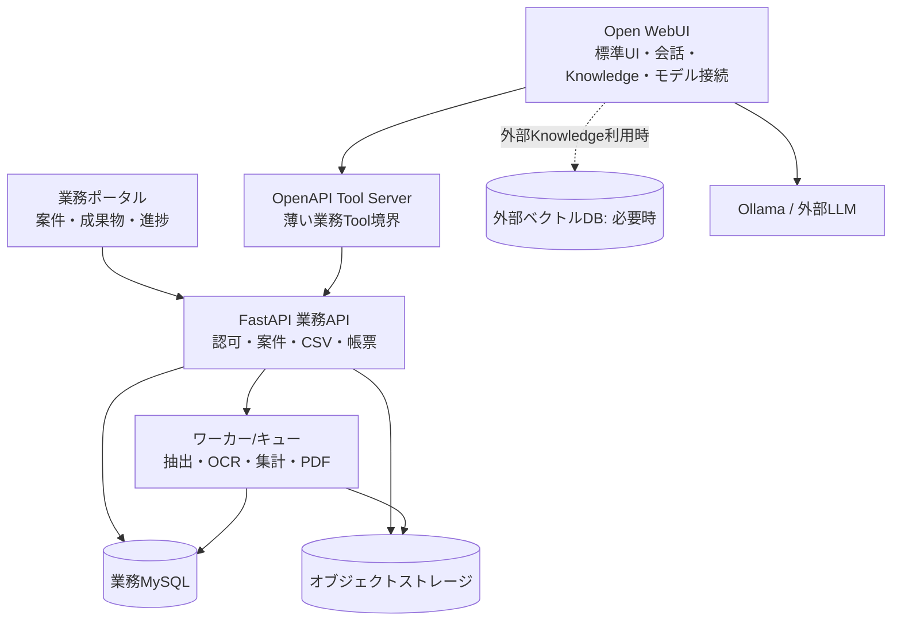

# Open WebUI 実装方針と移行境界

## 目標構成（提案）

## 実装の置き場

| 層 | 担当させるもの | 担当させないもの |
| --- | --- | --- |
| Open WebUI標準機能 | 会話、モデルプロバイダー接続、ファイル管理、Knowledge/RAG、標準ユーザー/グループ | 案件の正本、業務権限の最終判断、長時間ジョブ |
| Open WebUI設定 | モデル、埋め込み、文書抽出、Knowledgeアクセス、管理者設定 | 環境依存の業務ルール |
| Functions | 軽いFilter、Action、Pipe、表示補助。管理画面から設定する小さな拡張 | 大量の業務ロジック、DBスキーマ、秘匿性の高い業務認可 |
| OpenAPI Tools | CSV集計、案件検索、成果物登録、ジョブ照会の契約 | Open WebUI内部への密結合 |
| 独自フロントエンド | 案件台帳、成果物一覧、進捗、業務固有の編集/承認 | チャットUIの複製 |
| FastAPI/ワーカー | 認可、データ処理、文書パイプライン、帳票、外部連携、監査 | Open WebUIの内部テーブル操作 |
| 業務MySQL | 案件、メンバー、成果物、ジョブ、監査、データカタログ | Open WebUIの会話・Knowledge内部データの複製 |

## Open WebUIで対応できる範囲

Open WebUI公式資料上、Knowledgeは文書RAG・アクセス範囲・ファイル管理を提供し、Functionsは Pipe / Filter / Action / Event をサーバー側拡張として提供します。またOpenAPI Tool Serverを外部サービスとして登録できます。詳細は [Knowledge](https://docs.openwebui.com/features/workspace/knowledge/)、[Functions](https://docs.openwebui.com/features/extensibility/plugin/functions/)、[OpenAPI Tool Servers](https://docs.openwebui.com/features/extensibility/plugin/tools/openapi-servers/) を参照してください。

したがって、標準機能でまず対応するのは、会話、基本RAG、文書添付、モデル選択、標準ユーザー管理です。外部ベクトルDBのKnowledge連携は公式に実験的とされるため、採用するならバージョン固定を含む検証を行います。[RAGの外部Knowledge説明](https://docs.openwebui.com/features/chat-conversations/rag/)

## 独自実装として分離する範囲

- 案件ACL（Open WebUIユーザー/グループとの対応を含む）と案件選択コンテキスト
- CSV取込、データ品質確認、SQL集計、外部PostgreSQL取込、Text-to-SQLの安全実行
- 非同期OCR/解析、PDF生成、再試行・取消、成果物の版/承認
- 監査ログ、データ保持期限、バックアップ、業務通知
- 現行の多段推論・品質評価は、実利用の効果を測ってから独立ワークフローとして採用する

## Open WebUI本体との干渉を避ける注意点

1. 本体ソースをforkして変更せず、設定・Functions・OpenAPI Tool・外部サービスだけで拡張する。
2. Open WebUIの内部DB、内部テーブル、非公開API、DOM/CSSセレクタを業務機能の契約にしない。
3. FunctionはOpen WebUIのDBにPythonソースとして保存・実行される仕組みのため、最小に保つ。テスト・依存管理・秘密情報を要する処理はFastAPI側へ置く。
4. Tool呼出しを信頼境界とし、利用者入力の `project_id` やSQLをそのまま信用しない。業務APIで利用者・案件・操作権限を再検証する。
5. Tool入出力はバージョン付きOpenAPIスキーマに固定し、長時間処理は `job_id` を返す非同期契約にする。
6. Open WebUI更新前にステージングで、ログイン、Knowledge、Function、Tool、会話ストリームを回帰確認する。Open WebUIのリリース更新と業務API更新は別デプロイにする。

## 最小PoCの順序

1. Open WebUIを無改造で起動し、Ollama/利用予定モデル、PDF抽出、Knowledgeの日本語検索を評価する。
2. 業務MySQLとFastAPIで `案件一覧`、`案件権限確認`、`CSV安全集計` の3 APIを作る。
3. 3 APIをOpenAPI Toolとして接続し、案件スコープ逸脱・SQL注入・権限なしをテストする。
4. 資料/CSVの成果物保存と非同期PDF出力を追加し、最後に独自ポータルを実装する。

