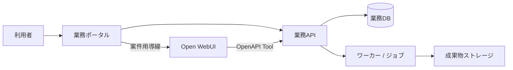

# Open WebUI 業務ポータル

更新日: 2026-07-12

## プロジェクト仕様

Open WebUIを無改造の会話基盤として利用し、案件単位で資料、CSV、成果物、進捗、権限を扱う業務ポータルを新規に構築する。現行PHP/MySQLシステムをそのまま移植せず、業務価値を独立した境界で再設計する。

| 領域 | 担当 |
| --- | --- |
| Open WebUI | 会話、モデル接続、Knowledge/RAG、標準ファイル管理、標準ユーザー管理 |
| 業務ポータル | 案件、メンバー、資料/CSV/成果物一覧、進捗、承認、Open WebUIへの導線 |
| 業務API / ワーカー | 案件ACL、CSV集計、帳票、非同期ジョブ、外部連携、監査 |
| Ollama | ローカルモデル実行。標準会話モデルは `gemma4:e2b`、埋め込みモデルは `mxbai-embed-large:latest` |

## 実装境界



- Open WebUIの内部DB、非公開API、DOM/CSSへ依存しない。
- Tool/APIはバージョン付き契約とし、業務APIで案件・利用者・操作権限を必ず再検証する。
- 長時間処理は `job_id` を返す非同期ジョブにし、ポータルで進捗と失敗理由を確認できるようにする。

## 対応機能と優先度

| 優先度 | 範囲 |
| --- | --- |
| P0 | 案件一覧/詳細、案件ロール、資料状態、成果物/ジョブ一覧、監査、Open WebUIへの案件用導線 |
| P1 | CSV/TSV取込、決定論的な安全集計、資料メモの版・承認、PDF帳票、非同期ワーカー |
| P2 | FAQ、CSV統合・AI分類、外部DB取込、図解の高度化 |
| 評価後 | 多段推論、LLM judge、横断調査、watchdog |

## UI / UX 仕様

現行のように案件一覧・案件タブ・チャットを一画面へ集約しない。案件の編集・資料/データ・成果物/進捗は業務ポータル、会話はOpen WebUIへ分離する。ただし、利用者が「どの案件を対象に、何を根拠に、どの成果物を作ったか」を一貫して把握できる体験を維持する。

### 画面の分担

| 画面/操作 | 主な利用者操作 | 実装先 |
| --- | --- | --- |
| ログイン、モデル選択、会話履歴、通常チャット、ファイル添付 | 会話とモデル利用 | Open WebUI標準 |
| 案件一覧 | 検索、状態確認、案件作成、案件選択 | 業務ポータル |
| 案件ホーム | 概要、所在地/期間/状態、参加者、資料/CSV/成果物件数、未完了ジョブの確認 | 業務ポータル |
| 資料・データ | アップロード、一覧、メタデータ、プレビュー、アクセス制御 | 業務ポータル + 業務API。公開対象のみKnowledgeへ同期 |
| 分析・帳票 | CSV集計、保存、生成ジョブの状態、成果物の閲覧/再生成 | 業務ポータル + 業務API / OpenAPI Tool |
| 資料質問、要約、Tool実行 | AIチャット | Open WebUI |

### 最小導線

```text
案件一覧 → 案件ホーム
              ├─ 資料・データを登録/確認
              ├─ AIチャットを開く（案件名・対象範囲を表示）
              └─ 成果物・ジョブを確認/再実行
```

1. 利用者は業務ポータルで案件を選び、権限と対象Knowledgeを確定する。
2. 資料質問はOpen WebUIのKnowledge/RAGを優先し、回答へ根拠リンクまたはファイル名を残す。
3. CSV集計、検索、登録、帳票生成はOpenAPI Tool経由で業務APIが実行し、案件・利用者・操作範囲を再検証する。
4. OCR、解析、PDF生成などの長時間処理は、即時に `job_id` を返す。ポータルで状態、結果、失敗理由、再実行を確認する。
5. 完成した資料、CSV、PDFはポータルの成果物一覧で版、作成日時、作成者とともに管理する。必要な公開版だけをKnowledgeへ同期する。

### AIチャットの要件

- チャット開始前に、案件名、利用可能な資料群、利用者権限を明示する。
- 「資料に質問」「CSVを集計」「報告書を作成」を、プロンプト例またはActionで選択できる。
- Tool実行時は、対象案件、対象ファイル、実行内容を短く表示する。
- 回答には根拠の種類を表示する。例: `資料RAG`、`CSV集計結果`、`生成した報告書`。
- 案件未選択、権限不足、資料未登録、集計対象未指定では一般的な回答で済ませず、次の操作を案内する。
- Open WebUIのテーマ、レイアウト、内部画面をカスタマイズ前提にしない。iframe埋込みやDOM操作は行わない。

### 視覚・操作の原則

- **案件優先**: ポータルの画面上部に案件名と状態を固定表示し、案件をまたぐ操作は確認を求める。
- **成果物優先**: 会話本文より、保存済み資料・CSV・PDFの名称、版、作成日時、作成者を追跡しやすくする。
- **状態を隠さない**: `受付済み / 実行中 / 完了 / 失敗 / 取消` を統一し、失敗時は利用者向け要約を表示する。
- **安全な既定値**: 上書き、公開、外部DB更新は初期状態で無効にし、実行前に確認する。
- **アクセシビリティ**: 状態を色だけで伝えず、アイコン、テキスト、キーボード操作、十分なコントラストを併用する。

### 図・報告書・CSVの扱い

- 業務上の数値は、業務APIが決定論的に返すChartデータまたは集計結果を唯一の根拠にする。説明図にはOpen WebUIのMarkdown/Mermaidを利用できる。
- 会話本文を直接PDF化しない。`ReportDraft`（結論、根拠、集計、留意点、出典、版）を利用者が確認してから、PDFジョブを実行する。
- CSVはMarkdown表の機械抽出に依存せず、集計Toolが返す構造化データから出力する。

## 実行・配布

### 開発・CI

Docker ComposeでOpen WebUI、ポータル、FastAPI、ワーカー、DB等を再現する。Pythonのテスト・Lint・デバッグは業務アプリのコンテナ内で行う。

現時点ではOpen WebUIのみ起動できる。Docker利用端末では次で起動する。

```sh
docker compose -f infra/compose.yaml up -d
```

Open WebUIは `http://localhost:3000`、ホストのOllamaは `host.docker.internal:11434` を使用する。

### DockerなしWindows PC

利用者PCでは既存のOllamaと `open-webui serve` を使う。業務ポータル/APIはOpen WebUIとは別のPython環境で実行し、`start-webui2.ps1` がOllama確認、必要時のOpen WebUI起動、業務アプリ起動をまとめて行う。

標準ポートは Ollama `11434`、Open WebUI `8080`、業務ポータル/API `8000` とする。

## 一時的な移行調査資料

- [移行資料一覧](docs/open_webui_migration_00_readme.md)

`docs/` の移行調査資料は、P0仕様を確定してこのファイルへ必要事項を統合した後に削除する。新しい方針・仕様・タスク・障害対応はルートの4ファイルだけを更新する。

## 文書の使い分け

- 開発規則は [agents.md](agents.md)
- 現在の作業は [todo.md](todo.md)
- エラー対応FAQは [troubleshoot.md](troubleshoot.md)
