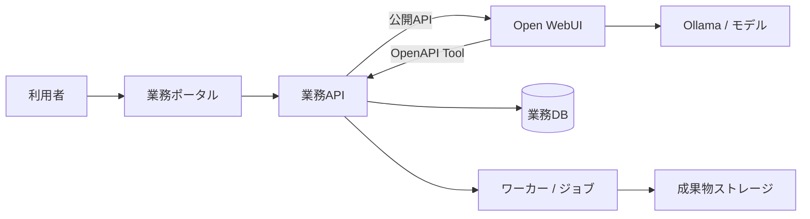

# Open WebUI 業務ポータル

更新日: 2026-07-12

## プロジェクト仕様

Open WebUIを無改造のRAG・会話基盤として利用し、案件単位で資料、チャットスレッド、成果物、進捗、権限を扱う業務ポータルを新規に構築する。現行PHP/MySQLシステムをそのまま移植せず、業務価値を独立した境界で再設計する。

案件は、Open WebUI上のRAG付きチャットスレッドをグループ化する業務単位である。1案件は案件情報、案件専用Knowledge、RAG対象ファイル、複数のチャットスレッド、使用モデル、システムプロンプト、メンバーと権限を持つ。

| 領域 | 担当 |
| --- | --- |
| Open WebUI | 案件専用Knowledge、RAG用ファイル、Embedding、モデル実行、チャットスレッド、メッセージ、システムプロンプト |
| 業務ポータル | 案件、メンバー、資料/CSV/成果物一覧、進捗、承認、案件内チャット、スレッド管理の画面 |
| 業務API / ワーカー | 案件ACL、Open WebUI公開APIの呼出し、Open WebUI ID対応、CSV集計、帳票、非同期ジョブ、監査 |
| Ollama | ローカルモデル実行。標準会話モデルは `gemma4:e2b`、埋め込みモデルは `mxbai-embed-large:latest` |

## 実装境界



- 利用者はOpen WebUIの画面を直接操作しない。案件一覧、資料登録、案件内チャット、スレッド管理はすべて業務ポータルから操作する。
- Open WebUIの内部DB、非公開API、画面遷移、iframe、DOM/CSSへ依存しない。
- 業務APIはOpen WebUIのFolder / Knowledge / Chat / File IDと案件を対応付け、案件・利用者・操作権限を必ず再検証する。
- Tool/APIはバージョン付き契約とし、Open WebUIの公開APIで実現可能な操作だけを採用する。
- 長時間処理は `job_id` を返す非同期ジョブにし、ポータルで進捗と失敗理由を確認できるようにする。
- 案件ごとにモデルを複製しない。共通モデルへ、案件専用Knowledge、案件内チャット、案件のシステムプロンプトを組み合わせる。

## 対応機能と優先度

| 優先度 | 範囲 |
| --- | --- |
| P0 | 案件一覧/ホーム、案件ロール、案件専用Knowledgeとファイルの対応、RAG同期状態、案件内チャット、スレッド一覧、監査 |
| P1 | CSV/TSV取込、決定論的な安全集計、資料メモの版・承認、PDF帳票、非同期ワーカー |
| P2 | FAQ、CSV統合・AI分類、外部DB取込、図解の高度化 |
| 評価後 | 多段推論、LLM judge、横断調査、watchdog |

## UI / UX 仕様

現行のように案件一覧・案件タブ・チャットを一画面へ集約しない。利用者の操作画面はすべて業務ポータルとし、ポータルがOpen WebUIの公開APIを呼んでRAGチャットを表示する。ただし、利用者が「どの案件を対象に、何を根拠に、どの成果物を作ったか」を一貫して把握できる体験を維持する。

### 画面の分担

| 画面/操作 | 主な利用者操作 | 実装先 |
| --- | --- | --- |
| 案件一覧 | 検索、状態確認、案件作成、案件選択 | 業務ポータル |
| 案件ホーム | 概要、所在地/期間/状態、参加者、Knowledge/RAG同期状態、資料/スレッド/成果物件数、未完了ジョブの確認 | 業務ポータル |
| 案件資料一覧 | アップロード、一覧、メタデータ、プレビュー、RAG同期状態、アクセス制御 | 業務ポータル + 業務API → Open WebUI公開API |
| 案件内チャット | 新規チャット、資料質問、要約、Tool実行、メッセージ表示 | 業務ポータル + 業務API → Open WebUI公開API |
| チャットスレッド一覧 | 同一案件のスレッド一覧、検索、選択、状態確認 | 業務ポータル + 業務API → Open WebUI公開API |
| 分析・帳票 | CSV集計、保存、生成ジョブの状態、成果物の閲覧/再生成 | 業務ポータル + 業務API / OpenAPI Tool |

### 最小導線

```text
案件一覧 → 案件ホーム
              ├─ 資料・データを登録/確認
              ├─ 新規チャットを作成 / 既存スレッドを開く
              └─ 成果物・ジョブを確認/再実行
```

1. 利用者がポータルから案件を作成すると、業務APIが案件情報を登録し、Open WebUI側へ案件専用Knowledgeを作成してIDを対応付ける。Folder / Projectを使う場合も、そのIDを対応付ける。
2. 利用者が資料をアップロードすると、業務APIがOpen WebUIへファイルを登録する。RAG処理完了後に案件専用Knowledgeへ追加し、ポータルで同期状態を表示する。
3. 利用者は案件ホームから新規チャットを作成し、案件専用Knowledgeと案件のシステムプロンプトを使ったRAGチャットを開始する。同一案件内の複数スレッドはポータルで管理する。
4. CSV集計、検索、登録、帳票生成はOpenAPI Tool経由で業務APIが実行し、案件・利用者・操作範囲を再検証する。
5. OCR、解析、PDF生成などの長時間処理は、即時に `job_id` を返す。ポータルで状態、結果、失敗理由、再実行を確認する。
6. 完成した資料、CSV、PDFはポータルの成果物一覧で版、作成日時、作成者とともに管理する。

### AIチャットの要件

- 案件内チャットはポータル内に実装し、Open WebUI画面へ遷移しない。チャット開始前に、案件名、利用可能な資料群、利用者権限を明示する。
- 「資料に質問」「CSVを集計」「報告書を作成」を、プロンプト例またはActionで選択できる。
- Tool実行時は、対象案件、対象ファイル、実行内容を短く表示する。
- 回答には根拠の種類を表示する。例: `資料RAG`、`CSV集計結果`、`生成した報告書`。
- 案件未選択、権限不足、資料未登録、集計対象未指定では一般的な回答で済ませず、次の操作を案内する。
- Open WebUIのテーマ、レイアウト、内部画面をカスタマイズ前提にしない。画面遷移、iframe埋込み、DOM/CSS操作は行わない。

### 視覚・操作の原則

- **案件優先**: ポータルの画面上部に案件名と状態を固定表示し、案件をまたぐ操作は確認を求める。
- **成果物優先**: 会話本文より、保存済み資料・CSV・PDFの名称、版、作成日時、作成者を追跡しやすくする。
- **状態を隠さない**: `受付済み / 実行中 / 完了 / 失敗 / 取消` を統一し、失敗時は利用者向け要約を表示する。
- **安全な既定値**: 上書き、公開、外部DB更新は初期状態で無効にし、実行前に確認する。
- **アクセシビリティ**: 状態を色だけで伝えず、アイコン、テキスト、キーボード操作、十分なコントラストを併用する。

### 図・報告書・CSVの扱い

- 業務上の数値は、業務APIが決定論的に返すChartデータまたは集計結果を唯一の根拠にする。説明図にはOpen WebUIのMarkdown/Mermaidを利用できる。
- 会話本文を直接PDF化しない。`ReportDraft`（結論、根拠、集計、留意点、出典、版）を利用者が確認してから、PDFジョブを実行する。
- CSVはMarkdown表の機械抽出に依存せず、集計Toolが返す構造化データから出力する。

## Open WebUI公開APIのP0検証

Open WebUIのREST APIは公式資料上でも実験的で、バージョンにより変更され得る。P0実装前に、固定対象バージョンでSwagger（`ENV=dev` の `/docs`）と実機を使い、次を検証して契約化する。APIキー/JWTの権限と、案件ACLを業務APIで再検証できることも各項目の必須条件とする。

| 検証項目 | 目的 | 確認観点 |
| --- | --- | --- |
| Knowledge作成 | 案件作成時に案件専用Knowledgeを作る | 作成/取得/削除の公開API、所有者、アクセス制御、Knowledge IDの取得 |
| ファイル登録 | 案件資料をOpen WebUIへ渡す | `POST /api/v1/files/`、ファイルID、形式/容量制限、失敗時のエラー |
| Knowledgeへのファイル追加 | RAG対象を案件専用Knowledgeに限定する | 処理完了後の `POST /api/v1/knowledge/{id}/file/add`、重複追加、権限エラー |
| RAG処理状態取得 | ポータルで同期状態を表示する | `GET /api/v1/files/{id}/process/status`、`completed` / `failed` / timeout の扱い |
| チャット作成 | 案件内の新規スレッドを作る | 公開APIでのchat ID作成、案件Knowledge/モデル/システムプロンプトの関連付け |
| チャット一覧取得 | 案件内の複数スレッドを表示する | 公開APIでの一覧/検索、案件外スレッドの非表示、ページング |
| メッセージ保存・取得 | ポータルで会話履歴を表示する | 公開APIでの保存/読出し、ストリーミング後の永続化、編集/再生成の扱い |
| Knowledge付きチャット実行 | 案件KnowledgeだけをRAG対象に会話する | `POST /api/chat/completions` の `files: [{type: "collection", id: knowledge_id}]`、ストリーミング、根拠情報 |
| システムプロンプト | 案件ごとにモデル複製なしで指示を適用する | リクエストごとのsystem messageと、Open WebUIのPrompt/Model設定のどちらを採用するか、保存範囲 |
| Folder / Project対応 | 案件内スレッドを補助的に整理する | 公開APIの有無、Knowledge自動付与の挙動、Folder IDの必要性 |

ファイル登録、処理状態取得、Knowledgeへの追加、Knowledge付きチャット実行は公式API資料に案内がある。一方、Knowledge作成、Folder / Project、チャットとメッセージの永続管理は、対象バージョンの公開APIと権限モデルを検証するまで実装前提にしない。公式資料は [API Endpoints](https://docs.openwebui.com/reference/api-endpoints/) を参照する。

## 実行・配布

### 開発・CI

Docker ComposeでOpen WebUI、ポータル、FastAPI、ワーカー、DB等を再現する。Pythonのテスト・Lint・デバッグは業務アプリのコンテナ内で行う。

現時点ではOpen WebUIのみ起動できる。Docker利用端末では次で起動する。

```sh
docker compose -f infra/compose.yaml up -d
```

Open WebUIは `http://localhost:3000`、ホストのOllamaは `host.docker.internal:11434` を使用する。

### DockerなしWindows PC

利用者PCでは既存のOllamaと `open-webui serve` を使う。業務ポータル/APIはOpen WebUIとは別のPython環境で実行し、`start-webui2.ps1` がOllama確認、必要時のOpen WebUI起動、業務アプリ起動をまとめて行う。

標準ポートは Ollama `11434`、Open WebUI `8080`、業務ポータル/API `8000` とする。

## 一時的な移行調査資料

- [移行資料一覧](docs/open_webui_migration_00_readme.md)

`docs/` の移行調査資料は、P0仕様を確定してこのファイルへ必要事項を統合した後に削除する。新しい方針・仕様・タスク・障害対応はルートの4ファイルだけを更新する。

## 文書の使い分け

- 開発規則は [agents.md](agents.md)
- 現在の作業は [todo.md](todo.md)
- エラー対応FAQは [troubleshoot.md](troubleshoot.md)
