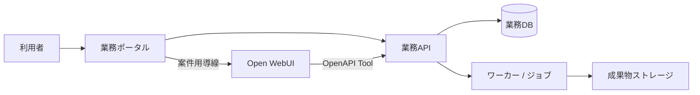

# Open WebUI 業務ポータル

更新日: 2026-07-12

## プロジェクト仕様

Open WebUIを無改造の会話基盤として利用し、案件単位で資料、CSV、成果物、進捗、権限を扱う業務ポータルを新規に構築する。現行PHP/MySQLシステムをそのまま移植せず、業務価値を独立した境界で再設計する。

| 領域 | 担当 |
| --- | --- |
| Open WebUI | 会話、モデル接続、Knowledge/RAG、標準ファイル管理、標準ユーザー管理 |
| 業務ポータル | 案件、メンバー、資料/CSV/成果物一覧、進捗、承認、Open WebUIへの導線 |
| 業務API / ワーカー | 案件ACL、CSV集計、帳票、非同期ジョブ、外部連携、監査 |
| Ollama | ローカルモデル実行。標準会話モデルは `gemma4:e2b`、埋め込みモデルは `mxbai-embed-large:latest` |

## 実装境界

- Open WebUIの内部DB、非公開API、DOM/CSSへ依存しない。
- Tool/APIはバージョン付き契約とし、業務APIで案件・利用者・操作権限を必ず再検証する。
- 長時間処理は `job_id` を返す非同期ジョブにし、ポータルで進捗と失敗理由を確認できるようにする。

## 対応機能と優先度

| 優先度 | 範囲 |
| --- | --- |
| P0 | 案件一覧/詳細、案件ロール、資料状態、成果物/ジョブ一覧、監査、Open WebUIへの案件用導線 |
| P1 | CSV/TSV取込、決定論的な安全集計、資料メモの版・承認、PDF帳票、非同期ワーカー |
| P2 | FAQ、CSV統合・AI分類、外部DB取込、図解の高度化 |
| 評価後 | 多段推論、LLM judge、横断調査、watchdog |

## 実行・配布

### 開発・CI

Docker ComposeでOpen WebUI、ポータル、FastAPI、ワーカー、DB等を再現する。Pythonのテスト・Lint・デバッグは業務アプリのコンテナ内で行う。

### DockerなしWindows PC

利用者PCでは既存のOllamaと `open-webui serve` を使う。業務ポータル/APIはOpen WebUIとは別のPython環境で実行し、`start-webui2.ps1` がOllama確認、必要時のOpen WebUI起動、業務アプリ起動をまとめて行う。

標準ポートは Ollama `11434`、Open WebUI `8080`、業務ポータル/API `8000` とする。

## 詳細設計・証跡

- [移行資料一覧](docs/open_webui_migration_00_readme.md)
- [業務ポータル開発計画](docs/frontend_delivery_plan.md)
- [Docker中心の開発・デバッグ環境計画](docs/docker_development_environment_plan.md)
- [Open WebUIと業務ポータルの管理方針](docs/runtime_management.md)
- [DockerなしWindows PCへの配布・起動計画](docs/windows_distribution_plan.md)

## 文書の使い分け

- 開発規則は [agents.md](agents.md)
- 現在の作業は [todo.md](todo.md)
- エラー対応FAQは [troubleshoot.md](troubleshoot.md)
