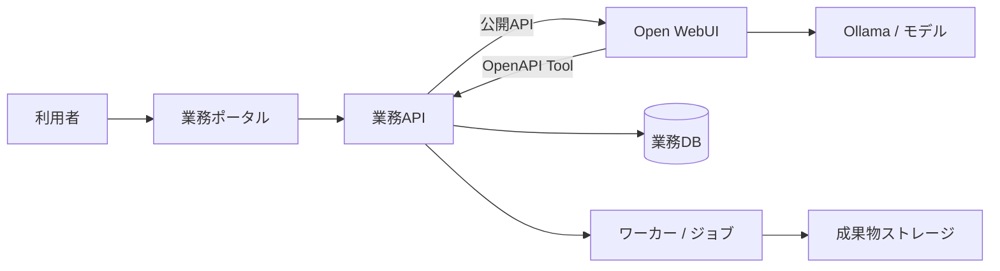

# Open WebUI 業務ポータル

更新日: 2026-07-12

## プロジェクト仕様

Open WebUIを無改造のRAG・会話基盤として利用し、案件単位で資料、チャットスレッド、成果物、進捗、権限を扱う業務ポータルを新規に構築する。現行PHP/MySQLシステムをそのまま移植せず、業務価値を独立した境界で再設計する。

案件は、Open WebUI上のRAG付きチャットスレッドをグループ化する業務単位である。1案件は案件情報、案件専用Knowledge、RAG対象ファイル、複数のチャットスレッド、使用モデル、システムプロンプト、メンバーと権限を持つ。

| 領域 | 担当 |
| --- | --- |
| Open WebUI | 案件専用Knowledge、RAG用ファイル、Embedding、モデル実行、チャットスレッド、メッセージ、システムプロンプト |
| 業務ポータル | 案件、メンバー、資料/CSV/成果物一覧、進捗、承認、案件内チャット、スレッド管理の画面 |
| 業務API / ワーカー | 案件ACL、Open WebUI公開APIの呼出し、Open WebUI ID対応、CSV集計、帳票、非同期ジョブ、監査 |
| Ollama | ローカルモデル実行。標準会話モデルは `gemma4:e2b`、埋め込みモデルは `mxbai-embed-large:latest` |

## 実装境界



- 利用者はOpen WebUIの画面を直接操作しない。案件一覧、資料登録、案件内チャット、スレッド管理はすべて業務ポータルから操作する。
- Open WebUIの内部DB、非公開API、画面遷移、iframe、DOM/CSSへ依存しない。
- 業務APIはOpen WebUIのFolder / Knowledge / Chat / File IDと案件を対応付ける。本番では案件・利用者・操作権限を必ず再検証する。
- Tool/APIはバージョン付き契約とし、Open WebUIの公開APIで実現可能な操作だけを採用する。
- 長時間処理は `job_id` を返す非同期ジョブにし、ポータルで進捗と失敗理由を確認できるようにする。
- 案件ごとにモデルを複製しない。共通モデルへ、案件専用Knowledge、案件内チャット、案件のシステムプロンプトを組み合わせる。

## 対応機能と優先度

| 優先度 | 範囲 |
| --- | --- |
| P0 | portal / backend開発基盤、案件一覧/ホーム、資料アップロード、案件専用Knowledgeとファイルの対応、RAG同期状態、案件内チャット、スレッド一覧、RAG回答確認 |
| P1 | UI/UX改善、CSV/TSV取込、決定論的な安全集計、資料メモの版・承認、PDF帳票、非同期ワーカー |
| P2 | FAQ、CSV統合・AI分類、外部DB取込、図解の高度化 |
| 後続 | 認証、案件ACL、監査、Windows本番環境対応、多段推論、LLM judge、横断調査、watchdog |

### 開発段階の認証方針

ローカル開発では、既存の管理者アカウントまたは固定開発ユーザーを使い、案件・資料・チャット・RAG連携が一連で動作することを優先する。サービスアカウント、最小権限、案件ACL、監査は本番前の必須作業として後続フェーズで実装する。

- password、JWT、APIキーをソースコード、Markdown、Git、ログへ保存しない。
- 開発設定と本番設定は分離する。開発用の認証省略・固定ユーザーを本番で使用しない。
- Open WebUIの公開API呼出しは、業務API内の専用Client / Adapterへ集約する。本番の認証・再認可を追加できる境界を維持する。

## UI / UX 仕様

現行のように案件一覧・案件タブ・チャットを一画面へ集約しない。利用者の操作画面はすべて業務ポータルとし、ポータルがOpen WebUIの公開APIを呼んでRAGチャットを表示する。ただし、利用者が「どの案件を対象に、何を根拠に、どの成果物を作ったか」を一貫して把握できる体験を維持する。

### 画面の分担

| 画面/操作 | 主な利用者操作 | 実装先 |
| --- | --- | --- |
| 案件一覧 | 検索、状態確認、案件作成、案件選択 | 業務ポータル |
| 案件ホーム | 概要、所在地/期間/状態、参加者、Knowledge/RAG同期状態、資料/スレッド/成果物件数、未完了ジョブの確認 | 業務ポータル |
| 案件資料一覧 | アップロード、一覧、メタデータ、プレビュー、RAG同期状態、アクセス制御 | 業務ポータル + 業務API → Open WebUI公開API |
| 案件内チャット | 新規チャット、資料質問、要約、Tool実行、メッセージ表示 | 業務ポータル + 業務API → Open WebUI公開API |
| チャットスレッド一覧 | 同一案件のスレッド一覧、検索、選択、状態確認 | 業務ポータル + 業務API → Open WebUI公開API |
| 分析・帳票 | CSV集計、保存、生成ジョブの状態、成果物の閲覧/再生成 | 業務ポータル + 業務API / OpenAPI Tool |

### 最小導線

```text
案件一覧 → 案件ホーム
              ├─ 資料・データを登録/確認
              ├─ 新規チャットを作成 / 既存スレッドを開く
              └─ 成果物・ジョブを確認/再実行
```

1. 利用者がポータルから案件を作成すると、業務APIが案件情報を登録し、Open WebUI側へ案件専用Knowledgeを作成してIDを対応付ける。Folder / Projectを使う場合も、そのIDを対応付ける。
2. 利用者が資料をアップロードすると、業務APIがOpen WebUIへファイルを登録する。RAG処理完了後に案件専用Knowledgeへ追加し、ポータルで同期状態を表示する。
3. 利用者は案件ホームから新規チャットを作成し、案件専用Knowledgeと案件のシステムプロンプトを使ったRAGチャットを開始する。同一案件内の複数スレッドはポータルで管理する。
4. CSV集計、検索、登録、帳票生成はOpenAPI Tool経由で業務APIが実行し、案件・利用者・操作範囲を再検証する。
5. OCR、解析、PDF生成などの長時間処理は、即時に `job_id` を返す。ポータルで状態、結果、失敗理由、再実行を確認する。
6. 完成した資料、CSV、PDFはポータルの成果物一覧で版、作成日時、作成者とともに管理する。

### AIチャットの要件

- 案件内チャットはポータル内に実装し、Open WebUI画面へ遷移しない。チャット開始前に、案件名、利用可能な資料群、利用者権限を明示する。
- 「資料に質問」「CSVを集計」「報告書を作成」を、プロンプト例またはActionで選択できる。
- Tool実行時は、対象案件、対象ファイル、実行内容を短く表示する。
- 回答には根拠の種類を表示する。例: `資料RAG`、`CSV集計結果`、`生成した報告書`。
- 案件未選択、権限不足、資料未登録、集計対象未指定では一般的な回答で済ませず、次の操作を案内する。
- Open WebUIのテーマ、レイアウト、内部画面をカスタマイズ前提にしない。画面遷移、iframe埋込み、DOM/CSS操作は行わない。

### 視覚・操作の原則

- **案件優先**: ポータルの画面上部に案件名と状態を固定表示し、案件をまたぐ操作は確認を求める。
- **成果物優先**: 会話本文より、保存済み資料・CSV・PDFの名称、版、作成日時、作成者を追跡しやすくする。
- **状態を隠さない**: `受付済み / 実行中 / 完了 / 失敗 / 取消` を統一し、失敗時は利用者向け要約を表示する。
- **安全な既定値**: 上書き、公開、外部DB更新は初期状態で無効にし、実行前に確認する。
- **アクセシビリティ**: 状態を色だけで伝えず、アイコン、テキスト、キーボード操作、十分なコントラストを併用する。

### 図・報告書・CSVの扱い

- 業務上の数値は、業務APIが決定論的に返すChartデータまたは集計結果を唯一の根拠にする。説明図にはOpen WebUIのMarkdown/Mermaidを利用できる。
- 会話本文を直接PDF化しない。`ReportDraft`（結論、根拠、集計、留意点、出典、版）を利用者が確認してから、PDFジョブを実行する。
- CSVはMarkdown表の機械抽出に依存せず、集計Toolが返す構造化データから出力する。

## Open WebUI公開APIのP0検証

Open WebUIのREST APIは公式資料上でも実験的で、バージョンにより変更され得る。P0実装前に、固定対象バージョンの公開APIだけを検証し、業務APIが案件ACLを再検証できることを必須条件とする。

### 初回の安全な疎通結果（2026-07-12）

検証対象はローカルOpen WebUI `v0.9.2` である。`GET /health` と `GET /api/config` は成功し、`/api/config` でオンボーディング未完了、ログインフォーム有効、APIキー無効を確認した。認証が必要な候補endpointは、書込みを伴わないリクエストで一律 `401 Not authenticated` を返したため、ネットワーク到達と認証要求までを確認した。初期管理者、APIキー、Knowledge、ファイル、チャットは作成していない。

| 機能 | 公開API | 実機確認 | 使用endpoint | 判定 |
| --- | --- | --- | --- | --- |
| 使用中のOpen WebUIバージョン | はい | `v0.9.2` を取得 | `GET /api/config` | 利用可能 |
| API認証方法 | はい | ログインendpointは必須項目不足で `422`、保護endpointは `401`。APIキーは無効 | `POST /api/v1/auths/signin`、`GET /api/config` | 条件付きで利用可能 |
| モデル一覧取得 | はい | 認証前は `401` | `GET /api/models` | 条件付きで利用可能 |
| Knowledgeの作成・一覧・詳細取得 | 候補endpointは公開APIとして到達 | 一覧/作成候補は認証前に `401`。認証後の作成・詳細・ACLは未実施 | `GET /api/v1/knowledge/`、`POST /api/v1/knowledge/create`、`GET /api/v1/knowledge/{id}` | 未確認 |
| ファイルアップロード | はい | 認証前に `401`。ファイルは未作成 | `POST /api/v1/files/` | 条件付きで利用可能 |
| ファイル処理状態取得 | はい | ダミーIDで認証前に `401`。実データでは未実施 | `GET /api/v1/files/{id}/process/status` | 条件付きで利用可能 |
| Knowledgeへのファイル追加 | はい | ダミーIDで認証前に `401`。実データでは未実施 | `POST /api/v1/knowledge/{id}/file/add` | 条件付きで利用可能 |
| Knowledge付きチャット実行 | はい | 認証前に `401`。モデル実行は未実施 | `POST /api/chat/completions` | 条件付きで利用可能 |
| チャットスレッドの作成・保存 | 公開候補だが対象版の契約未確定 | 認証前に `401`。作成・保存は未実施 | `POST /api/v1/chats/new`、`POST /api/v1/chats/{id}` | 未確認 |
| チャット一覧・メッセージ取得 | 公開候補だが対象版の契約未確定 | 認証前に `401`。一覧・詳細は未実施 | `GET /api/v1/chats/`、`GET /api/v1/chats/{id}` | 未確認 |

ファイル登録、処理状態取得、Knowledgeへの追加、Knowledge付きチャット実行は公式API資料に案内がある。チャット永続化の資料には古いバージョン向けの例もあるため、対象版 `v0.9.2` の認証済み実機で再確認するまで本採用しない。公式資料は [API Endpoints](https://docs.openwebui.com/reference/api-endpoints/) と [Backend-Controlled API Flow](https://docs.openwebui.com/reference/api-flow/) を参照する。

### 案件とOpen WebUI IDの対応案

業務DBを案件・ACLの正本とし、Open WebUIのIDは外部リソース参照として保持する。Open WebUIの内部DBは参照・更新しない。

| 業務側の情報 | 対応するOpen WebUI情報 | 用途 |
| --- | --- | --- |
| `project.id` | `knowledge_id` | 案件専用Knowledgeの参照 |
| `project_document.id` | `file_id`、同期状態、同期エラー要約 | 資料とRAG処理の追跡 |
| `project_chat.id` | `chat_id`、モデルID、システムプロンプト版 | 案件内スレッドの追跡 |
| `project.id` | 任意の `folder_id` / `project_id` | 対象版で公開APIが確認できた場合だけ補助的に使用 |
| `project_member` | Open WebUIユーザーIDまたは統合用サービスアカウント | 業務ACLとOpen WebUI認証の対応 |

業務ポータル側は、案件情報、案件コード、状態、メンバー/ロール、上記ID対応、同期/ジョブ状態、操作履歴、承認、成果物メタデータを保持する。システムプロンプトは案件ごとに版管理し、対象版で公開APIの保存方法が確認できるまでは、業務APIがチャット実行時にsystem messageとして適用する方式を候補とする。

### P0設計の変更点と次の最小API契約

- 開発段階では、既存管理者または固定開発ユーザーのJWTをプロセス内だけで使い、認証設定を理由にP0実装を停止しない。本番前に、バックエンドだけが保持する統合用サービスアカウント/APIキーまたは同等の最小権限方式へ切り替える。
- チャット一覧・保存・メッセージ取得が対象版の公開APIで完結しない場合、Open WebUIの非公開APIや内部DBで補わない。その場合は、P0のスレッド永続化方式を再設計する。
- Folder / Projectは必須にしない。案件専用Knowledgeと業務DBのID対応をP0の最小単位とする。

最初に業務APIで契約化する候補は以下である。各endpointは業務ACLを検証した後にのみOpen WebUI公開APIを呼ぶ。

| 業務API | 最小の責務 |
| --- | --- |
| `POST /projects` | 案件作成と案件専用Knowledge作成、`knowledge_id` の保存 |
| `POST /projects/{project_id}/documents` | 資料を1件登録し、`file_id` と同期状態を保存 |
| `GET /projects/{project_id}/documents/{document_id}/sync-status` | RAG処理状態と利用者向けエラー要約を返す |
| `POST /projects/{project_id}/chats` | 案件Knowledge・モデル・システムプロンプトを指定してスレッドを作成 |
| `GET /projects/{project_id}/chats` | 案件に対応するスレッドだけを返す |
| `POST /projects/{project_id}/chats/{chat_id}/messages` | 権限確認後にKnowledge付きチャットを実行し、ストリーム/結果を返す |

## 実行・配布

### 開発・CI

Docker ComposeでOpen WebUI、ポータル、FastAPI、ワーカー、DB等を再現する。Pythonのテスト・Lint・デバッグは業務アプリのコンテナ内で行う。

現時点では、固定開発データを返す `backend`、案件一覧/ホーム、資料一覧、案件内チャットを表示する `portal`、Open WebUIを並行起動できる。資料・スレッド・メッセージのメタデータはbackendプロセス内の開発用インメモリ保存であり、再起動で消える。Docker利用端末では次で起動する。

```sh
docker compose -f infra/compose.yaml up -d --build
```

| サービス | URL |
| --- | --- |
| Open WebUI | `http://localhost:3000` |
| 業務ポータル | `http://localhost:5173` |
| 業務API | `http://localhost:8000` |

Open WebUIはホストのOllamaを `host.docker.internal:11434` で使用する。

案件資料は開発用の `backend-development-data` Dockerボリュームへ保存し、資料メタデータと案件/Knowledge ID対応はbackendプロセス内だけで保持する。backendの再起動後、資料一覧と対応メタデータは消えるため、この保存方式は開発確認専用である。

Open WebUI連携は `OPENWEBUI_CLIENT_MODE` で切り替える。既定の `mock` は実通信を行わず、資料同期を `not_started → pending → processing → synced` と再現し、同期済み資料がある案件では固定のRAG回答と根拠を返す。`live` はGit管理外の環境変数から認証情報を読み、公開APIだけでKnowledge作成、ファイル登録、処理状態取得、Knowledge関連付け、`POST /api/chat/completions` によるKnowledge付き回答を行う。認証情報やOpen WebUI接続が利用できない場合は、ポータル全体を停止せず該当操作だけを安全に失敗させる。Open WebUI側のチャットスレッド保存は対象版の公開API契約が未確認のため、現段階では業務backend内でのみ管理する。

### DockerなしWindows PC

利用者PCでは既存のOllamaと `open-webui serve` を使う。業務ポータル/APIはOpen WebUIとは別のPython環境で実行し、`start-webui2.ps1` がOllama確認、必要時のOpen WebUI起動、業務アプリ起動をまとめて行う。

標準ポートは Ollama `11434`、Open WebUI `8080`、業務ポータル/API `8000` とする。

## 一時的な移行調査資料

- [移行資料一覧](docs/open_webui_migration_00_readme.md)

`docs/` の移行調査資料は、P0仕様を確定してこのファイルへ必要事項を統合した後に削除する。新しい方針・仕様・タスク・障害対応はルートの4ファイルだけを更新する。

## 文書の使い分け

- 開発規則は [agents.md](agents.md)
- 現在の作業は [todo.md](todo.md)
- エラー対応FAQは [troubleshoot.md](troubleshoot.md)
